# Deterministic-first acceptance audit

## Production ordering and migration

```mermaid
flowchart LR
    I[Identity] --> A[Acquire and cache]
    A --> M[MIR and cache]
    M --> D[Deterministic discovery and parsing]
    D --> S[Rank and select]
    S --> B[Schema-valid baseline]
    B --> T[Snap, optional LRC, section timing]
    T --> G[Collapse guard and confidence]
    G --> Q[Quality and fault attribution]
    Q -->|pass| P[Optimistic-lock store]
    Q -->|SOURCE, AUDIO, UNKNOWN| R[Needs review; no model]
    Q -->|actionable MODEL only| C[One compact conflict packet]
    C --> O[Closed patch operations]
    O --> L[Apply locally and rerun deterministic passes]
    L --> P
```



`agentPolicy=unresolved_only` is the production default. `never` disables the
bounded patch; `always` preserves the historical full-reconciliation
experiment. Existing experimental callers that require the old path should
send `agentPolicy=always` explicitly. `provider=mock` is a test-only path: it
must be explicitly named, its Song has `testOnly=true`, and storing it requires
`allowTestOutput=true`.

## Benchmark

Run from the repository root:

```bash
.venv/bin/python scripts/benchmark_deterministic.py
```

The fixed recording is Amy Winehouse, “Back to Black,” YouTube ID
`TJAfLE39ZZ8`. The command always runs with agent policy `never` and reports
acquisition/cache status, MIR time, baseline time, deterministic alignment
time, quality score/verdict/fault, model calls, model cost, and whether human or
agent intervention is required. A download, dependency, or evidence failure is
printed as benchmark evidence and is never replaced by model output.

## Acceptance matrix

| Requirement | Implementation | Test evidence | Remaining limitation |
|---|---|---|---|
| Source, candidate, baseline MCP tools | `snoocle_server/mcp_server.py` source/baseline section | `tests/test_mcp_deterministic_tools.py` | Caller-provided source text remains subject to upstream source quality. |
| MIR, timing, quality leaf tools | `snoocle_server/mcp_server.py` deterministic leaf section | `tests/test_mcp_deterministic_leaf_tools.py` | Live acquisition and LRCLIB depend on their external services. |
| Direct aligner and processor | `snoocle_server/deterministic.py`, `deterministic_process.py` | `tests/test_deterministic_core.py`, `test_mcp_deterministic_orchestrators.py` | Strict selection returns `needs_review` when sources are too close to choose safely. |
| Deterministic-first policy | `snoocle_server/deterministic_policy.py`, `pipeline.py` | `tests/test_deterministic_agent_policy.py` | In-process `anthropic-agent` does not implement the compact patch contract and is refused on that branch. |
| Lyric-free bounded patch | `build_conflict_packet`, `validate_compact_conflict_packet`, closed `patch_ops` | `tests/test_deterministic_agent_policy.py` | The patch vocabulary intentionally cannot change lyric text. |
| Mock production guard | `Song.testOnly`, `test_output.py`, pipeline/API/MCP store gates | `tests/test_mock_guard_and_capabilities.py` | Legacy stored placeholders can be diagnosed but are not automatically deleted or rewritten. |
| Capability discovery | MCP `list_capabilities` | `tests/test_mock_guard_and_capabilities.py` | Capability metadata describes registered tools in this build. |
| Deterministic observability | `StageObservation`, deterministic MCP envelope, stored run traces | deterministic MCP and orchestrator tests | Provider usage reliability remains provider-dependent on the bounded patch branch. |
| Reproducible benchmark | `scripts/benchmark_deterministic.py` | benchmark JSON recorded below for each release | YouTube, ffmpeg, and MIR dependencies are environment prerequisites. |

## Release verification record

This record is from the current revision and environment; historical numbers
are not carried forward.

- Benchmark (`TJAfLE39ZZ8`, `agentPolicy=never`): `needs_review` /
  `candidate_sources_conflict`; acquisition cache miss in 3,196 ms, MIR cache
  miss in 40,869 ms, discovery cache miss, baseline 14 ms, deterministic
  alignment 0 ms because strict selection stopped before alignment, quality and
  fault attribution unavailable, 0 model calls, $0 model cost, intervention
  required. General-search backends had no configured API key (and DuckDuckGo
  returned no results); Ultimate Guitar still supplied conflicting candidates.
- Canonical Python suite: `1,228 passed, 33 skipped` in 36.37 seconds; the
  JavaScript tests embedded by `tests/test_player_ui.py` also passed.
- JavaScript suite: `50 passed, 0 failed` via
  `node --test "tests_js/*.test.mjs"`.
- Exclusions: none unless a synchronized duplicate file is identified and
  documented by exact path and hash.
